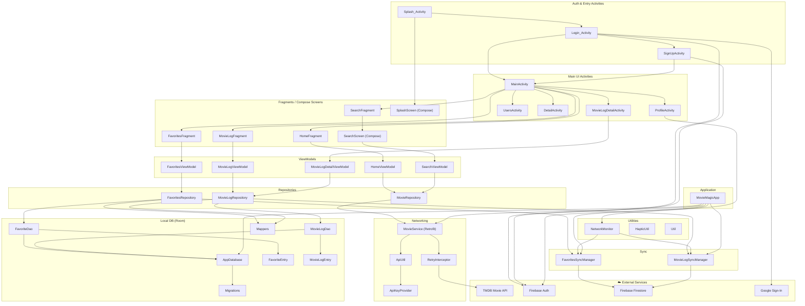

# Movie_Project — System Design

This document explains the architecture of **Movie_Project** and shows how to render
the diagram in [Excalidraw](https://excalidraw.com/) for editing.

---

## How to view / edit in Excalidraw

Excalidraw moved this feature around — here are the three reliable ways to get the Mermaid diagram in. Use whichever you can find:

### Option 1 — Bottom toolbar AI button (fastest)
1. Open <https://excalidraw.com/>.
2. Look at the **bottom-left of the canvas** for a small icon (a magic-wand / sparkle / "AI" button — it sits just above the zoom controls).
3. Click it and pick **"Mermaid to Excalidraw"**.
4. Open `docs/system-design.mmd`, copy its **entire** contents, paste them into the dialog, click **Insert**.

### Option 2 — Standalone Mermaid-to-Excalidraw playground (always works)
1. Open <https://mermaid-to-excalidraw.vercel.app/> in your browser.
2. Paste the contents of `docs/system-design.mmd` into the left panel.
3. The right panel renders the diagram live. Click **"Copy to clipboard"** (Excalidraw format).
4. Switch to <https://excalidraw.com/> and press `Cmd+V` (macOS) / `Ctrl+V` (Win/Linux) on the empty canvas — the diagram drops in as editable shapes.

### Option 3 — Drag-and-drop the `.mmd` file
1. Open <https://excalidraw.com/>.
2. Drag `docs/system-design.mmd` from Finder/Android Studio's project view directly onto the canvas. If your Excalidraw build supports it, it will offer to import the Mermaid source.

### After importing
- Every subgraph, node, and arrow is an editable Excalidraw shape — drag, restyle, recolor, or annotate freely.
- Save your work via **hamburger menu → Save to…** (writes a `.excalidraw` file) so future edits are one click away.

> Tip: GitHub renders the Mermaid block below natively, so you can preview the diagram without ever leaving the repo.

---

## Architecture at a glance

Movie_Project is an Android app following **MVVM + Repository** with offline-first
caching (Room) and cloud sync (Firestore).

### Layers (top → bottom)

| Layer | Color | Components |
|---|---|---|
| **External Services** | gray | TMDB Movie API, Firebase Auth, Firebase Firestore, Google Sign-In |
| **Application** | pink | `MovieMagicApp` (Application class — wires DB / network / sync at startup) |
| **Auth & Entry Activities** | blue | `Splash_Activity`, `Login_Activity`, `SignUpActivity` |
| **Main UI Activities** | blue | `MainActivity`, `ProfileActivity`, `UsersActivity`, `DetailActivity`, `MovieLogDetailActivity` |
| **Fragments / Compose** | blue | `HomeFragment`, `FavoritesFragment`, `SearchFragment` + `SearchScreen`, `MovieLogFragment`, `SplashScreen` |
| **ViewModels** | purple | `HomeViewModel`, `FavoritesViewModel`, `SearchViewModel`, `MovieLogViewModel`, `MovieLogDetailViewModel` |
| **Repositories** | green | `MovieRepository`, `FavoritesRepository`, `MovieLogRepository` |
| **Networking** | red | `MovieService` (Retrofit), `RetryInterceptor`, `ApiUtil`, `ApiKeyProvider` |
| **Local DB (Room)** | orange | `AppDatabase`, `FavoriteDao`, `MovieLogDao`, `FavoriteEntry`, `MovieLogEntry`, `Mappers`, `Migrations` |
| **Sync** | yellow | `FavoritesSyncManager`, `MovieLogSyncManager` |
| **Utilities** | gray | `NetworkMonitor`, `HapticUtil`, `Util` |

### Key data flows

- **Browse / Search:** Fragment → ViewModel → `MovieRepository` → `MovieService` → `RetryInterceptor` → **TMDB API**.
- **Favorites:** Fragment → `FavoritesViewModel` → `FavoritesRepository` → `FavoriteDao` (Room) + `FavoritesSyncManager` → **Firestore**.
- **Movie Log:** Fragment → `MovieLogViewModel` → `MovieLogRepository` → `MovieLogDao` (Room) + `MovieLogSyncManager` → **Firestore**.
- **Auth:** `Login_Activity` / `SignUpActivity` → **Firebase Auth** (+ Google Sign-In on login).
- **Connectivity:** `NetworkMonitor` notifies the sync managers when the device reconnects, triggering a flush of locally-queued changes.

---

## Diagram (Mermaid)

---

## Files in this folder

- `system-design.mmd` — the canonical Mermaid source (paste this into Excalidraw).
- `system-design.md` — this document.

When the architecture changes, update `system-design.mmd` first, then re-import into Excalidraw.